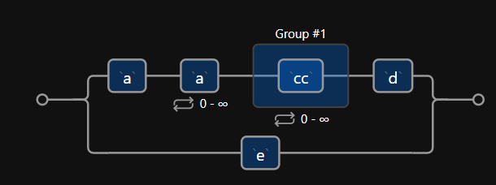

#### 经验

抓取的瓶颈主要在对方对你的抓取的容忍程度以及在爬和反爬策略的博弈的结果[看知乎专业反爬虫]

1. robots记录了爬虫的访问规则 ：https://www.zhihu.com/robots.txt

   - Disallow为空表示可以允许所有爬虫访问任何url

   - Disallow: /user表示所有爬虫不允许爬取根路径下user开头的url
   - Scrapy中，注释掉setting.py文件中的**ROBOTSTXT_OBEY**选项
2. Headers的user agent 提供用户的**浏览器类型、操作系统及版本、CPU 类型、浏览器渲染引擎、浏览器语言、浏览器插件等信息**的标识。
   1. 可以在https://www.whatismybrowser.com/检查
   2. 通常真正重要的参数就是User-Agent
      1. 假设你想为一个机器学习的研究项目写一个语言翻译机，却没有大量的翻译文本来
         测试它的效果。很多大型网站都会为同样的内容提供不同的语言翻译，根据请求
         头的参数响应网站不同的语言版本。因此，你只要简单地把请求头属性从Accept-Language:en-US 修改成Accept-Language:fr，就可以从网站上获得“Bonjour”（法语，
         你好）这些数据来改善翻译机的翻译效果了（大型跨国企业通常都是好的采集对象）。
      1. 请求头还可以让网站改变内容的布局样式。例如，用移动设备浏览网站时，通常会看
         到一个没有广告、Flash 以及其他干扰的简化的网站版本。因此，把你的请求头User-
         Agent 改成下面这样，就可以看到一个更容易采集的网站了！
      3. 有的网站会建立User-Agent的白名单，只有在白名单中的用户才能正常访问，还有一部分网站会对Referer进行检测（一些资源网站的防盗链就是检测Referer）。如果遇到了这类反爬虫机制，可以直接在爬虫中添加Headers，将浏览器的User-Agent复制到爬虫的Headers中；或者将Referer值修改为目标网站域名。对于检测Headers的反爬虫，在爬虫中修改或者添加Headers就能很好的绕过
   3. 可以使用 [GitHub - hellysmile/fake-useragent: up to date simple useragent faker with real world database](http://github.com/hellysmile/fake-useragent)。其实我也推荐大家伪装成各大搜索网站的UA， 比如Google UA 有这样一些 [Google 抓取工具](http://support.google.com/webmasters/answer/1061943?hl=zh-Hans)，说到这里，有的网站，你添加referfer字段是搜索网站也是有用的，因为网站是希望被索引的，所以会放宽搜索引擎的爬取策略。 比如把user-agent改 Baiduspider+，现在很多网站搜集了正常搜索引擎的IP段，这样越来越难了
3. cookie：
4. ip:  

   - 通过检测用户行为，例如同一IP短时间内多次访问同一页面，或者同一账户短时间内多次进行相同操作。对于这种情况，使用IP代理就可以解决。可以专门写一个爬虫，爬取网上公开的代理ip，检测后全部保存起来。这样的代理ip爬虫经常会用到，最好自己准备一个。有了大量代理ip后可以每请求几次更换一个ip
   - 爬取间隔自适应。就是已经限制了你这个IP的抓取，就不要傻傻重复试，怎么滴也得休息一会。网易云音乐操作起来比较简单，sleep一下就好了。其实sleep的间隔应该按情况累加，比如第一次sleep 10秒，发现还是被约束。那么久sleep 20秒... 这个间隔的设置已经自适应的最终效果是经验值。
   - 避免短时间内连续访问，比如在setting.py文件中设置延时让爬虫每隔一段时间访问一次网站。Scrapy中，通过setting.py文件中的**DOWNLOAD_DELAY**字段来设置下载延时
   - setting.py文件中新建一个PROXIES列表来存放一些代理，并在下载中间件中随机选择使用
5. ajax 现在有一些网站使用了异步加载的技术，就是让一部分网页信息先加载出来，然后剩下的东西在满足某种条件下才会被加载，这样做的好处是可以提高网页的加载速度

   - 首先确定html源文件有没有，有的是写在html里边，只不过没有加载渲染(比如网易新闻)
   - Network分析 找出数据文件(XHR)
   - 如果能够找到ajax请求，也能分析出具体的参数和响应的具体含义，我们就能采用上面的方法，直接利用requests模拟ajax请求，对响应的json进行分析得到需要的数据
6. 字体反爬 https://zhuanlan.zhihu.com/p/41130693
7. Twitter 的API 请求限制有两种方法：每15 分钟15 次和每15 分钟180 次
8. CAPTCHA **验证码识别**。现在攻防让验证码技术层出不穷，其实好多都是自己写算法识别，并不开源，开源的就是tesseract，还可以借用[百度识图平台](http://gist.github.com/browsnet/17a93b7e327cf0dc8bcc)试试。我个人还是倾其所有的做好其他的地方，不要让人家弹出验证码让我输入。
   1. Pillow 和Tesseract
9. 表单提交、模拟登录
   1. requests库可以

   2. 在HTML 表单中，“隐含”字段可以让字段的值对浏览器可见，但是对用户不可见（除非
      看网页源代码）。
      1. 第一种是表单页面上的一个字段可以用
         服务器生成的随机变量表示。如果提交时这个值不在表单处理页面上，服务器就有理由认
         为这个提交不是从原始表单页面上提交的，而是由一个网络机器人直接提交到表单处理页
         面的。绕开这个问题的最佳方法就是，首先采集表单所在页面上生成的随机变量，然后再
         提交到表单处理页面。
      2. 如果表单里包含一个具有普通名称的隐含字段（设置
         蜜罐圈套），比如“用户名”（username）或“邮箱地址”（email address），设计不太好的网
         络机器人往往不管这个字段是不是对用户可见，直接填写这个字段并向服务器提交，这样
         就会中服务器的蜜罐圈套。服务器会把所有隐含字段的真实值（或者与表单提交页面的默
         认值不同的值）都忽略，而且填写隐含字段的访问用户也可能被网站封杀

   3. 如果网络表单的一个字段通过
      CSS 设置成对用户不可见，那么可以认为普通用户访问网站的时候不能填写这个字段，因
      为它没有显示在浏览器上。如果这个字段被填写了，就可能是机器人干的，因此这个提交
      会失效。
10. 最终办法：PhantomJS、Headless Firefox、Puppeteer模拟访问 
    1. 其实就是用Python 的第三方库运行JavaScript，完成浏览器的功能
    2. 有些网站把ajax请求的所有参数全部加密了。我们根本没办法构造自己所需要的数据的请求。我这几天爬的那个网站就是这样，除了加密ajax参数，它还把一些基本的功能都封装了，全部都是在调用自己的接口，而接口参数都是加密的。遇到这样的网站，我们就不能用上面的方法了，我用的是selenium+phantomJS框架，调用浏览器内核，并利用phantomJS执行js来模拟人为操作以及触发页面中的js脚本。从填写表单到点击按钮再到滚动页面，全部都可以模拟，不考虑具体的请求和响应过程，只是完完整整的把人浏览页面获取数据的过程模拟一遍。


1. 爬虫法律法规：https://github.com/HiddenStrawberry/Crawler_Illegal_Cases_In_China

   1. 爬虫的定义是收集信息而不改变网络现状。例如，现在的政府和安全部门有专门的部门，利用网络爬虫软件对网络公开信息里的敏感信息进行抓取，然后人工审核和分析信息里舆情和危害信息，对案件原始线索进行预警处理。这个过程并不对原信息产生任何影响和改变，也不侵犯任何公民和组织的信息及隐私安全，是完全合法的行为。
   2. 但如果你在使用网络爬虫抓取信息的同时，采取了改变原计算机系统数据（例如：利用程序模拟点击、录入订票、购物、修改评价信息等）的行为，就涉嫌危害计算机系统安全的法律规定，情节严重的就可以定性为犯罪行为。

2. 基本的爬虫工作原理

   1. 网络浏览器就是代码，而代码是可以分解的，可以分解成许多基本组件，可重写、重用，以及做成我们想要的任何东西

   2. 现在大多数网页需要加载许多相关的资源文件。可能是图像文件、JavaScript文件、CSS 文件，获取它们的方法是通过url获取。所以爬虫编码过程主要是如何找到这些url。

      ```
       # 这行代码会去拿本目录下的xx.jpg
      ```

   3. 利用HTTP 从网络服务获取信息有四种方式  GET POST PUT DELETE

      1. http 带有查询字段的url，get请求一般会将来请求的数据附在url之后，以?分割url和传输数据，多个参数用&连接

   4. 网页前端迭代非常快，样式非常不统一，所以保证程序正常运行，异常处理非常有必要

      1. 尽量使用用于CSS的class 和id 属性标签，这些一般不会有经常变动

   5. JS是运行在浏览器而非服务器上的语言

      - 你在浏览器上看到的内容，与你用爬虫从网站上采集的内容不一样
      - 网页用一个加载页面把你引到另一个页面上，但是网页的URL 链接在这个过程中一直没有变化

3. 基本的工具

   1. 网络请求urllib2$\rightarrow$requests
   2. 解析网页re $\rightarrow$BeautifulSoup$\rightarrow$lxml /xpath
      1. 字符串有时可以split然后取对应索引，避开re
      3. xpath：有chrome插件可以自动生成，但是注意关闭js
   3. scrapy框架(/skrepa/)
      1. Scrapy使用了异步网络框架来处理网络通讯，可以获得较快的下载速度，因此，我们不需要去自己实现异步框架。并且，Scrapy包含了各种中间件接口，可以灵活的完成各种需求
   4. 之后遇到了一些有验证码的网站，于是知道了PIL。但后来知道了opencv，pybrain。当在爬虫中用上人工神经网络识别出验证码，兴奋得守在爬虫旁边看他爬完全站。再后来知道了threading，知道了celery
   5. 有效地判重 
      2. set  python的set用hash实现
      3. Bloom Filter判重: [Bloom Filters by Example](http://billmill.org/bloomfilter-tutorial/)  用Bloom Filter 可以使用固定的内存（不随url的数量而增长）以O(1)的效率判定url是否已经在set中

4. 一定要防止「由于异常等原因造成爬虫程序错误，重新启动还会重新爬」的尴尬。我建了一张Process表，用来存爬取的状态：开始爬取置状态为「PENDING」，抓取完成置状态为「 SUCCEEDED」（当然也有失败，比如页面解析未覆盖到情况造成的失败，之后失败的状态应该没有条目才对，否则就要去兼容）。每次抓取程序启动都会检查哪些PENDING的先抓完，抓过的直接忽略去下一个。[状态机]

5. 合理控制速度是你不应该破坏的规则。这不仅是因为过度消耗别人的服务器资源会让你置身于非法境地，而且你这么做可能会把一个小型网站拖垮甚至下线。拖垮网站是一件不道德的事情：是彻头彻尾的错误。所以请控制你的采集速度！

5. 分布式：如果需要大规模网页抓取，你需要学习分布式爬虫的概念。其实没那么玄乎，你只要学会怎样维护一个所有集群机器能够有效分享的分布式队列就好。最简单的实现是python-rq: [https://github.com/nvie/rq](http://github.com/nvie/rq)

6. 有效地存储 rq和Scrapy的结合：[darkrho/scrapy-redis · GitHub ](http://github.com/darkrho/scrapy-redis) 存储(Mongodb)

   > 爬取豆瓣的时候，我总共用了100多台机器昼夜不停地运行了一个月

7. 后续处理，网页析取([grangier/python-goose · GitHub](http://github.com/grangier/python-goose))，


#### 逻辑

处理url逻辑：bfs 

```
import Queue
initial_page = "http://www.renminribao.com"
url_queue = Queue.Queue()
seen = set()

seen.insert(initial_page)
url_queue.put(initial_page)
while(True):
    if url_queue.size()>0:
        current_url = url_queue.get()    
        .... 爬取内容            
        for next_url in extract_urls(current_url): 
            if next_url not in seen:      
                seen.put(next_url)
                url_queue.put(next_url)
    else:
        break
```

给定url如何爬取内容：

```python
# -*- coding: utf-8 -*-
import os
import requests
from lxml import html

headers = {
    'Host': 'www.zhihu.com',
    'Accept-Language': 'zh-CN,zh;q=0.8,en;q=0.6',
    # 2017.12 经网友提醒，知乎更新后启用了网页压缩，所以不能再采用该压缩头部
    # !!!注意, 请求头部里使用gzip, 响应的网页内容不一定被压缩，这得看目标网站是否压缩网页
    # 'Accept-Encoding': 'gzip, deflate, sdch, br',
    'Connection': 'keep-alive',
    'Pragma': 'no-cache',
    'Cache-Control': 'no-cache',
    'Upgrade-Insecure-Requests': '1',
    'Accept': 'text/html,application/xhtml+xml,application/xml;q=0.9,image/webp,*/*;q=0.8',
    'User-Agent': 'Mozilla/5.0 (Macintosh; Intel Mac OS X 10_12_4) '
                  'AppleWebKit/537.36 (KHTML, like Gecko) Chrome/57.0.2987.133 Safari/537.36',
}

def crawl(url):
	# http 请求
    resp = requests.get(url, headers=headers)
    # html 解析
    page = resp.content
    root = html.fromstring(page)
    image_urls = root.xpath('//img[@data-original]/@data-original')
    for image_url in image_urls:
        save_image(image_url)
```

---

#### TODO

- stackoverflow scrapy multiple ip multiple user agent...


- 教程：https://github.com/lining0806/PythonSpiderNotes
- book
- https://www.zhihu.com/column/zhiqi-scrapy
- 更多教程 https://github.com/search?o=desc&q=scrapy&s=stars&type=Repositories


- 网易云音乐API分析 https://github.com/darknessomi/musicbox/wiki/%E7%BD%91%E6%98%93%E4%BA%91%E9%9F%B3%E4%B9%90API%E5%88%86%E6%9E%90
- https://www.zhihu.com/question/41505181
- 可以获取信息的网站：https://www.zhihu.com/question/36132174
- 可以干的事情 https://www.zhihu.com/question/27621722
- 参考项目https://www.zhihu.com/question/58151047

---

##### 正则表达式：

- 至少一个a： aa*  a+

- 两个cc为一个单位：(cc)*

-  `aa*(cc)*d|e`

  

- ==不用$的时候，其实正则表达式默认是`xx.*` 从字符串开头进行匹配 比如`^a` 能够匹配`aaaaaa...`==

- 


